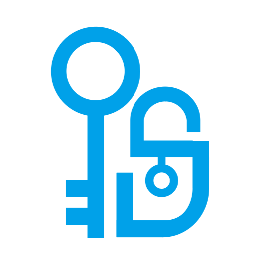
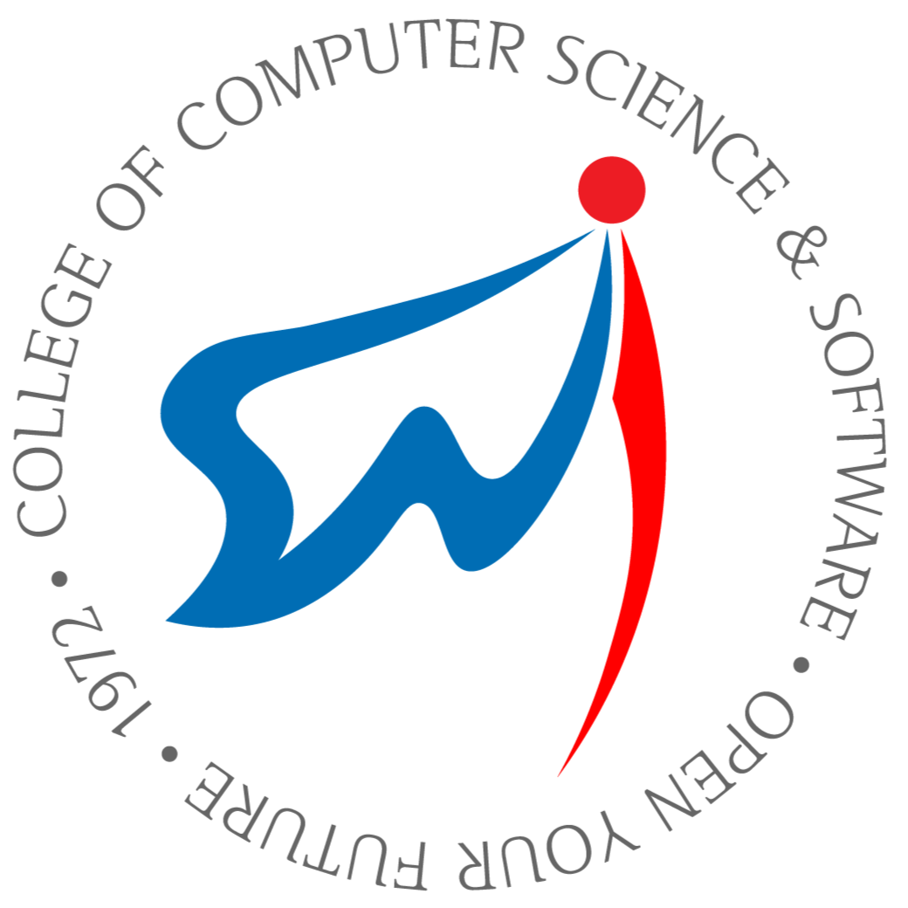
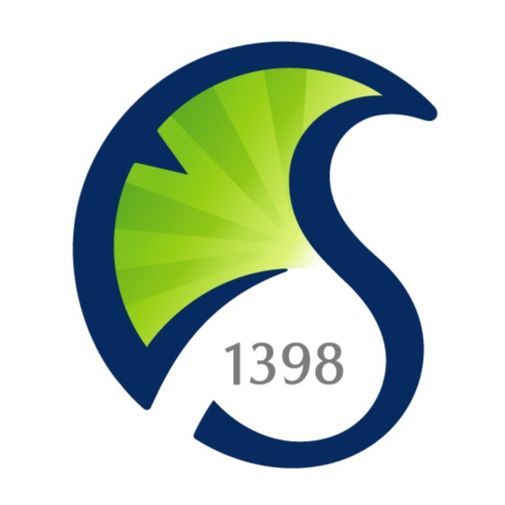
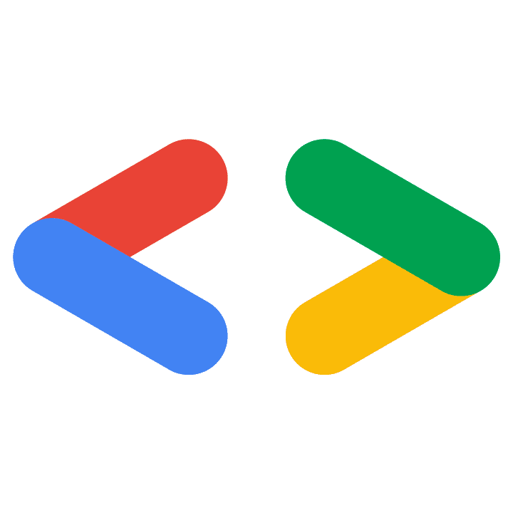
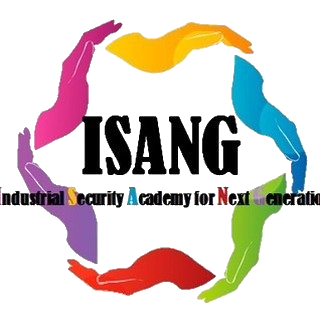
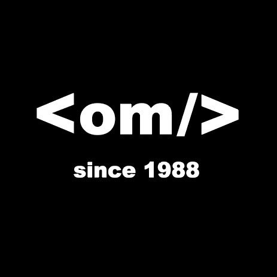

# Welcome to Rolling Ress GitHub

Welcome back, this is Karu from Rolling Ress.  
Please refer to [GitHub.io Webpage](https://karu-rress.github.io/)

## I'm...

A student interested in how advancements in computer science & engineering transform people’s lives.
-  [Goyang Global High School](https://ggg.hs.kr:535) 10th alumnus (2020/03-2023/02)  
-  [Dept. of Industrial Security](https://security.cau.ac.kr/) at Chung-Ang University (2023/03-2024/01)
-  [School of Computer Science & Engineering](https://cse.cau.ac.kr/) at Chung-Ang Univ. (2024/02-2026/02)
-  [Dept. of Computer Science & Engineering](https://cse.skku.edu/) at Sungkyunkwan Univ. (since 2026/03)  
-  [Google Developer Student Clubs CAU](https://gdsc-cau.com/) 23-24 Core Member
-  Researcher in ISANG, an infosec club at CAU IS (2023/03-2024/02)  
-  37th member in COMP, a Web-app developing club.
- Intern researcher at Wireline Communication Lab in [Woorinet](https://www.woori-net.com/) (2023/07-08)  
- Undergraduate research assistant in [CPSS Lab](https://github.com/CAU-CPSS) of CAU IS (2024/03-2025/06)
- Republic of Korea Navy, Information & Communication (since 2025/06)

  
## 스스로 진화하는 소프트웨어
### Self-evolving Software

### 프로그래밍 언어와 AI의 힘으로,   스스로 진화하는 소프트웨어의 시대를 열다
  
  
> “소프트웨어가 스스로 성능을 개선하고 보안 오류를 고칠 수는 없을까?”  
  
  
소프트웨어를 통해 사람들의 삶이 개선되는 과정에 관심이 많기에, 모든 프로그램이 기반이 되는 학문을 연구하고 있습니다.  
이제는 사람이 소프트웨어의 오류와 취약점을 감지하는 것을 넘어, **프로그램이 스스로 오류를 고치고 진화**할 수 있어야 합니다. 코드를 이용한 정적 분석과 바이너리를 통한 동적 분석을 AI로 자동화하여, 잠재적인 보안 위협을 자동으로 제거하고 성능을 높이도록 개량하는 프레임워크를 만들고자 합니다. 이를 통해 프로그램 개발자는 생산성과 효율성을 극대화하고, 사용자는 프로그램의 높은 보안성을 신뢰하고 안정적으로 서비스를 사용할 수 있도록 하겠습니다.  

프로그램에서 레거시 코드를 탐지하고, 모던 코드로 패치하여 개발자의 실수를 줄이고 자원 관리의 자동화를 추구할 것입니다. BOF와 SQL 인젝션 등 대중적인 해킹 기법에 취약한 부분은 입력값을 추가로 검증하는 과정을 자동으로 도입하여 보안 취약점을 개선하고자 합니다. 이러한 검증 및 수정 단계를 코드 작성, 컴파일, 배포 등 다양한 상황으로 확장하고, 특정 프로그래밍 언어에 종속되지 않는 보안성 및 성능 개선 프레임워크를 제작하는 것이 장기적인 목표입니다.  이를 바탕으로 소프트웨어가 스스로 보안성과 성능을 높이는 꾸준한 진화를 이루고, **인류가 프로그램을 작성하고 사용하는 경험이 새롭게 바뀌도록** 노력하겠습니다.

---

### WHY CYBERSECURITY?

왜 컴퓨터공학을 전공하면서, 사이버보안을 함께 탐구했을까요?

컴퓨터공학자는 사용자들이 안전한 환경에서 디지털 세상을 누릴 수 있도록 해야 합니다.  
보안은 신뢰이며, 보안을 잃은 프로그램은 아무리 편리해도 신뢰받을 수 없습니다.  

대부분의 보안 문제가 사람에 의해 일어나는 만큼, 사람에 대한 이해와 함께  
사이버보안 지식을 결합하여 더욱 안전하고 신뢰할 수 있는 디지털 세상을 만들어 나가겠습니다.

  
## My Devices

🖥️ Desktop: R5 5600X + RTX 3070  
💻 ASUS ZenBook Flip 14 (2023) & ThinkPad L13 Yoga (2020)  
📱 V60 ThinQ (2020) & Redmi Note 10 (2021) & Galaxy S10 (2019) & Galaxy A5 (2017)  
📱 Onyx Poke 2 (E-Book Reader)  
📱 Galaxy Tab S7 FE (2021)  
⌚ CMF Watch Pro (2024)  
🎧 Nothing Ear (2) (2022)  

  
## What can I do

### Programming Languages + Other Languages
(Sorted by preference)\
\

\

\

\

\
Also designing my own programming language, Rang.

### Frameworks & Others

\

### What I'm Studying

\

\

  
## What I use
### Tools & Programs

\

\
\

### OSes - Currently in use

### What have been my main OSes

## Also I love it

## My other websites

[link](https://blog.naver.com/rollingress)

### Statistics
\

<!--
**karu-rress/karu-rress** is a ✨ _special_ ✨ repository because its `README.md` (this file) appears on your GitHub profile.

Here are some ideas to get you started:

- 🔭 I’m currently working on ...
- 🌱 I’m currently learning ...
- 👯 I’m looking to collaborate on ...
- 🤔 I’m looking for help with ...
- 💬 Ask me about ...
- 📫 How to reach me: ...
- 😄 Pronouns: ...
- ⚡ Fun fact: ...
-->
